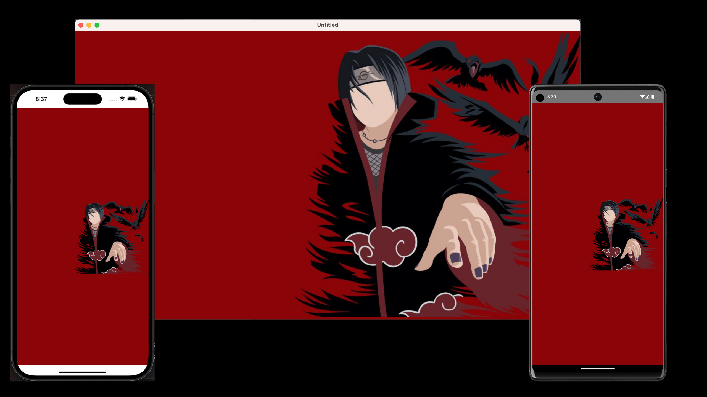

# Compose Multiplatform Template

# Template App

Shared Compose UI between Android, iOS, Desktop, Browser

**Compose Multiplatform** is a declarative framework for sharing UIs across multiple platforms with Kotlin.
It is based on [Jetpack Compose](https://developer.android.com/jetpack/compose) and developed by [JetBrains](https://www.jetbrains.com/) and open-source contributors.

You can choose the platforms across which to share your UIs using Compose Multiplatform:

* [iOS](https://github.com/JetBrains/compose-multiplatform-ios-android-template/#readme) (Alpha)
* [Android](https://developer.android.com/jetpack/compose) (via Jetpack Compose)
* [Desktop](https://github.com/JetBrains/compose-multiplatform-desktop-template/#readme) (Windows, MacOS, Linux)
* [Web](https://kotl.in/wasm-compose-example) (Experimental)

For example, you can share UIs between iOS and Android or Windows and MacOS.

![Shared UIs of the iOS, Android, desktop, and web apps]

## Build and run

Check out the repo, navigate to the project folder, and use the following commands:

### Run Web version via Gradle

`./gradlew :webApp:wasmRun`

### Run Desktop version via Gradle

`./gradlew :desktopApp:run`

### Install Android application via Gradle

`./gradlew :androidApp:installDebug`

## IDE

We recommend using [IntelliJ IDEA 2023.1 or newer](https://www.jetbrains.com/idea/) to work with the project.

# Learn more

* [Compose Multiplatform](https://github.com/JetBrains/compose-multiplatform/#compose-multiplatform)
